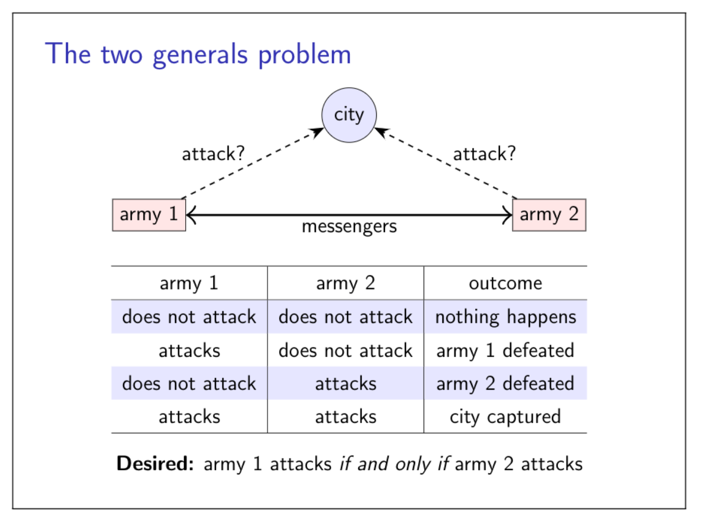
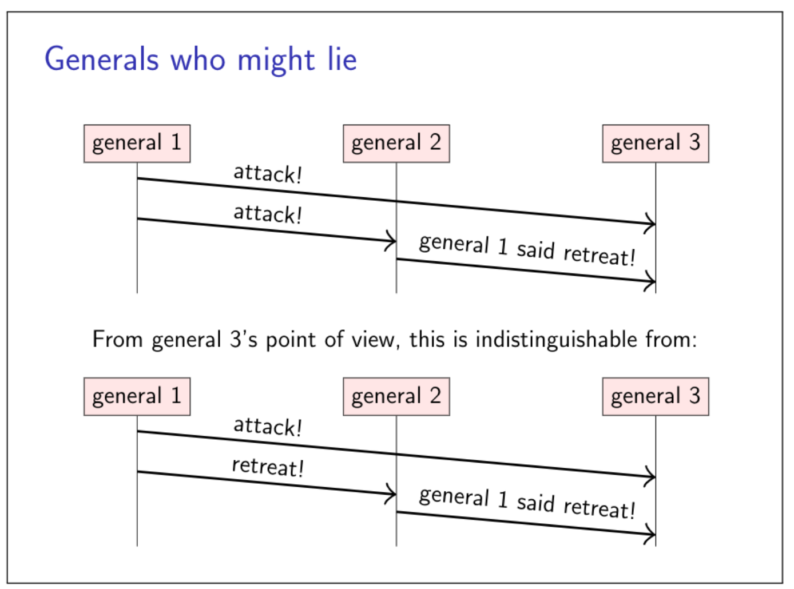
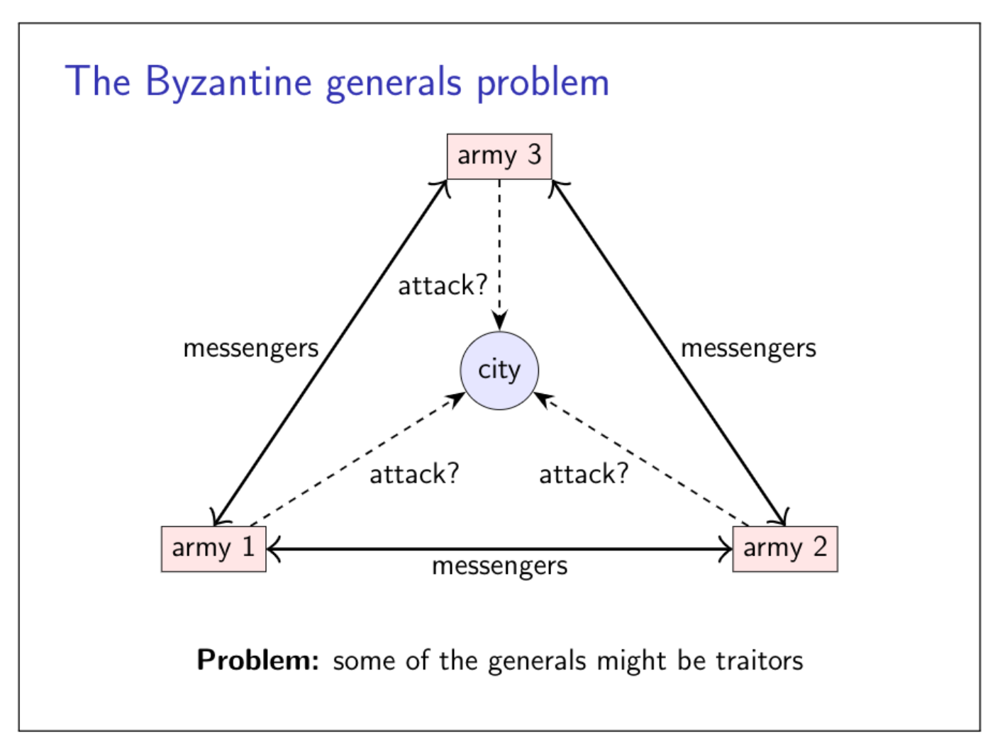

## 2.1 The two generals problem
The two generals problme is proposed by Jim N. Gray in 1978.
Jim N. Gray. Notes on data base operating systems. In R. Bayer, R.M. Graham, and G. Seegmuller, editors, Operating Systems, volume 60 of LNCS, pages 393–481. Springer, 1978. doi:10.1007/3-540-08755-9 9. URL http: //jimgray.azurewebsites.net/papers/dbos.pdf.

### How should the genrals decide

- General 1 always attacks, even if no response is received?
   - Send lots of messengers to increase probability that one will get through
   - If all are captured, general 2 does not know about the attack, so general 1 loses
- General 1 only attacks if positive reponse from general 2 is received?
   - Now general 1 is safe
   - But general 2 knows that general 1 will only attack if general 2's response gets through
   - Now general 2 is in the same situation as general 1 in option 1
## 2.2 The Byzantine generals problem
The Byzantine generals problem is proposed by Lamport in 1982.
Leslie Lamport, Robert Shostak, and Marshall Pease. The Byzantine generals problem. ACM Transactions on Programming Languages and Systems, 4(3):382–401, 1982. doi:10.1145/357172.357176. URL http://research.microsoft.com/en-us/um/ people/lamport/pubs/byz.pdf.

The challenge in the Byzantine setting is that some generals might be "traitors": they might try to deliberately and maliciously mislead and confuse the other generals.

### The Byzantine generals problem

- Each general is either malicous or honese
- Up to f generals might be malicious
- Honest generals don't know who the malicious ones are
- The malicious generals may collude
- Nevertheless, honest generals must agree on plan
- Theorem: need 3f+1 generals in total  to tolerate f malicious generals
- Cryptography(digital signatures) helps, but problem remians hard
## 2.3 Describing nodes and network behaviour
### System models
Caputure assumptions is a system model consisting of:

- Network behaviour: e.g. message loss
- Node behaviour: e.g. crashes
- Timing behaviour: e.g. latency
### Network behaviour
Assume bidirectional point-to-point communication between two nodes, with one of:

- Reliable (perfect) links: A message is received if and only if  it is sent. Message may be reordered.
- Fair-loss links: Messages may be lost, duplicated or reordered. If you keep retrying, a message eventually gets through.
- Arbitrary links (active adversary): A malicious adversary may interfere with messages(eavesdrop, modify, drop, spoof, replay)

Fair-loss link can turn into a reliable link by continually retransmitting lost messages until they are finally received, and by filtering out duplicated messages on the recipient side.
An arbitrary link can trun into a fair-loss link by cryptographic techniques.
### Node behaviour
Each node executes a specified algorithm, assuming one of the following:

- Crash-stop (fail-stop): A node is faulty if it crashes (at any moment). After crashing, it stops executing forever.
- Crash-recovery (fail-recovery): A node may crash at any moment, losing its in-memory state. It may resume executing sometime later. Data stored on disk survives the crash.
- Byzantine (fail-arbitrary): A node is faulty if it deviates from the algorithm. Faulty nodes may do anything, including crashing ro malicious behaviour.
### Timing behaviour/synchrony (timeing) assumptions
Assume one of the following for network and nodes:

- Synchronous: Message latency no greater than a known upper bound. Nodes execute algorithm at a known speed.
- Partially synchronous: The system is asynchronous for some finite (but unknown) periods of time, synchronous otherwise.
- Asynchronous: Messages can be delayed arbitrarily. Node can pause execution arbitrarily. No timing guarantees at all.
### Violations of synchrony in practice
Networks usually have quite predictable latency, which can occasionally increase:

- Mesage loss requiring retry
- Congestion/contention causing queueing
- Network/route reconfiguration

Nodes usually execute code at a predictable speed, with occasional pauses:

- Operating system scheduling issues, e.g. priority inversion
- Stop-the-world garbage collection pauses
- Page faults, swap, thrashing
## 2.4 Fault tolerance and high availability

- SLO: service-level objective
- SLA: service-level agreement: contract specifying some SLO, penalties for violation
### Achieving high availability: Fault Tolerance

- Failure: system as a whole isn't working
- Fault: some part of the system isn't working
   - Node fault: crash(crash-stop/crash-recovery), deviating from algorithm(Byzantine)
   - Network fault: droping or significantly delaying messages
- Fault tolerance: system as a whole continues working, despite faults (up to some maximum number of faults)
- Single point of failure (SPOF): node/network link whose fault leads to failure
### Failure detectors

- Failure detector: algorithm that detects whether another node is faulty
- Perfect failure detector: labels a node as faulty if and only if it has crashed
- Typical implementation for crash-stop/crash-recovery: send messages, await response, label node as crashed if no reply within some timeout
- Problem: cannot tell the difference between crashed node, temporarily unresponsive node, lost message, and delayed message
### Failure detection in partially synchronous systems
Eventually perfect failure detector:

- May temporarily label a node as crashed, even though it is correct
- May temporarily label a node as correct, even though is has crashed
- But eventually, labels a node a crashed if and only if it has crashed
