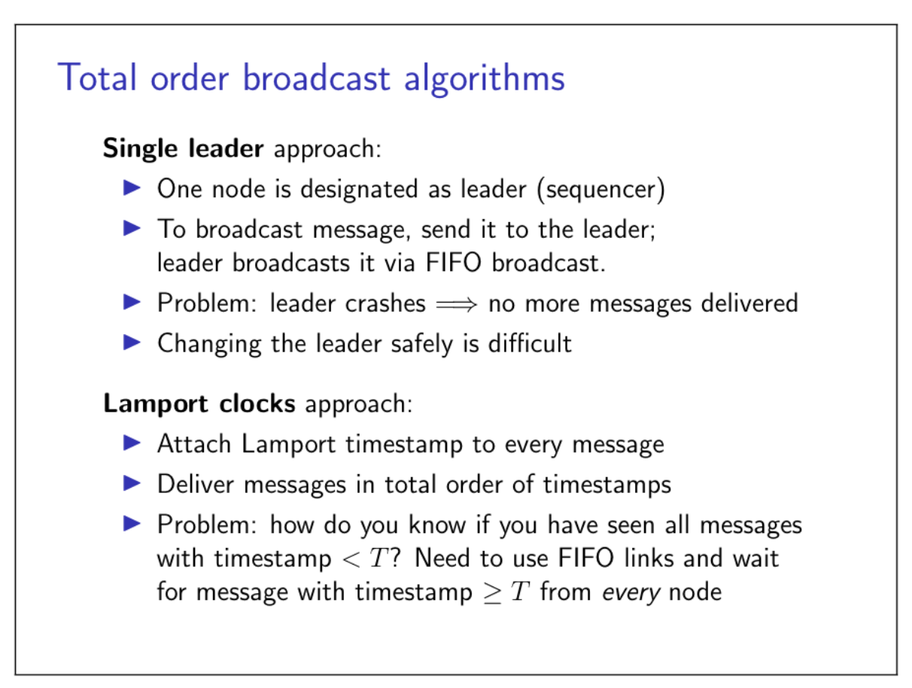

## 4.1 Logical time
### Pyhsical timestamps inconsistent with causality

### Physical clocks vs. Logical

- **Pysical clock**: count number of seconds elapsed
- **Logical clock**: count number of evnets occurred

Logical clocks are designed to **capture causal dependencies**.
### Lamport clocks algorithm

A Lamport timestamp is essentially an integer that counts the number of events that have occurred. As such, it has no direct relationship to pyhsical time.

Happens-before relation is a partial order.
Lamport timestamps is a total order. But it is in general not possible to tell whether those events are concurrent or whether one happened before the other. If we want to acheive these, we need a different type of logical time: a vector clock.
### Vector clocks

Lamport clocks provides a total order.
Vector clocks captures the partial order of happens-before.
## 4.2 Delivery order in broadcast protocols
### Broadcast protocols
Broadcast (multicast) in group communication:

- One node sends message, all nodes in group deliver it
- Set of group members may be fixed (static) or dynamic
- If one node is faulty, remaining group members carry on
- Note: concept is more general than IP multicast
### Receiving versus delivering

### Forms of reliable broadcast
#### FIFO broadcast
If m1 and m2 are broadcast by the same node, and broadcast(m1) -> broadcast(m2), then m1 must be delivered before m2.
#### Causal broadcast
If broadcast(m1) -> broadcast(m2) then m1 must be delivered before m2.
#### Total order broadcast
If m1 is delivered before m2 on one node, then m1 must be delivered before m2 on all nodes.
#### FIFO-total order broadcast
Combination of FIFO broadcast and total order broadcast.
### FIFO broadcast

### Causal broadcast

### Total order broadcast

### Relationships between broadcast models

## 4.3 Broadcast algorithms
### Broadcast algorithms
Break down into two layers:

- Make best-effort broadcast reliable by retransmitting dropped messages (retry + deduplicate)
- Enforce delivery order on top of reliable broadcast
### Eager reliable broadcast

### Gossip protocols

### FIFO broadcast algorithm

### Causal broadcast algorithm

### Total order broadcast algorithms

