Replication means to maintain a copy of the same data on mutiple nodes, each of which is called a replica.

- Keeping a copy of the same data on multiple nodes
- Databases, filesystems, caches, ...
- A node that has a copy of the data is called a **replica**
- If some replicas are faulty, others are still accessible
- Spread load across many replicas
- Easy if the data doesn't change: just copy it
- It will be complicated if data change

Comparation with RAID (Redundant Array of Independent Disks):

- RAID has single controller; in distributed system, each node acts independently
- Replicas can be distributed around the world, near users
## 5.1 Manipulating remote state
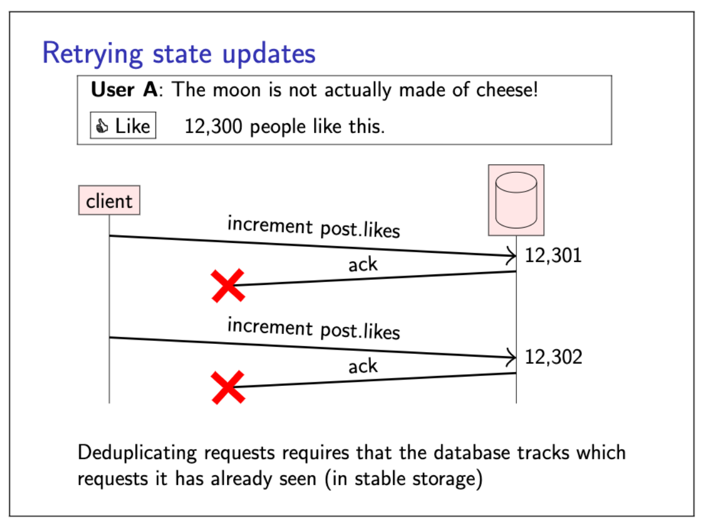
One way of preventing an update from taking effect multiple times is to deduplicate requests. However, in a crash-recovery system model, this requires storing requests (or some metadata about requests, such as a vector clock) in stable storage, so that duplicates can be accurately detected even after a crash.
An alternative to recording requests for deduplication is to make requests **idempotent**.
### Idempotence
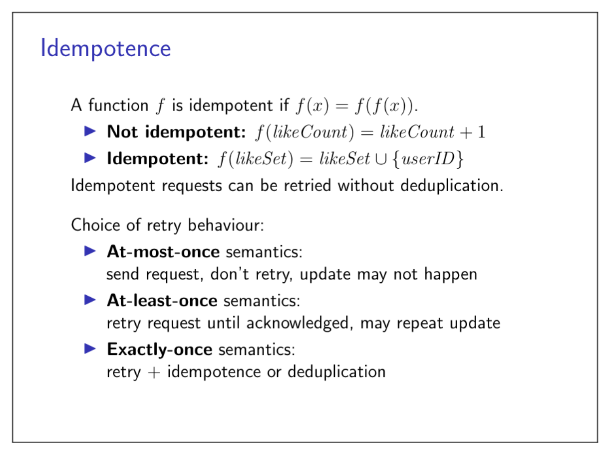
An idempotent update can safely be retried, because performing it several times has the same effect as performing it once.
However, idempotence has a limitation that becomes apparent when there are multiple updates in progress.
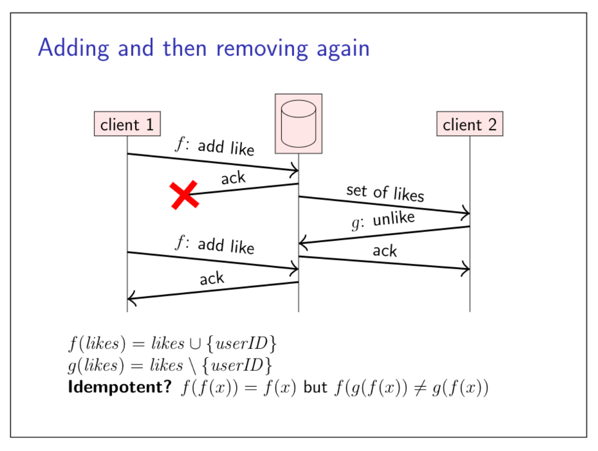
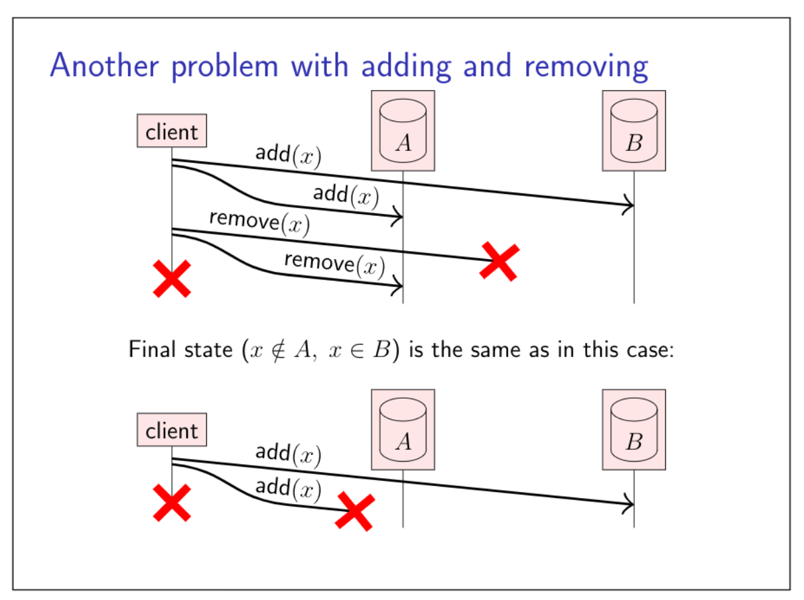
To solve this problem, we can do two things.

- attach a logical timestamp to every update operation, and store that timestamp in the database as part of the data written by the update
- don't actually remote the record when asked to remote a record from the database, but rather write a special type of update (called a tombstone) marking it as deleted

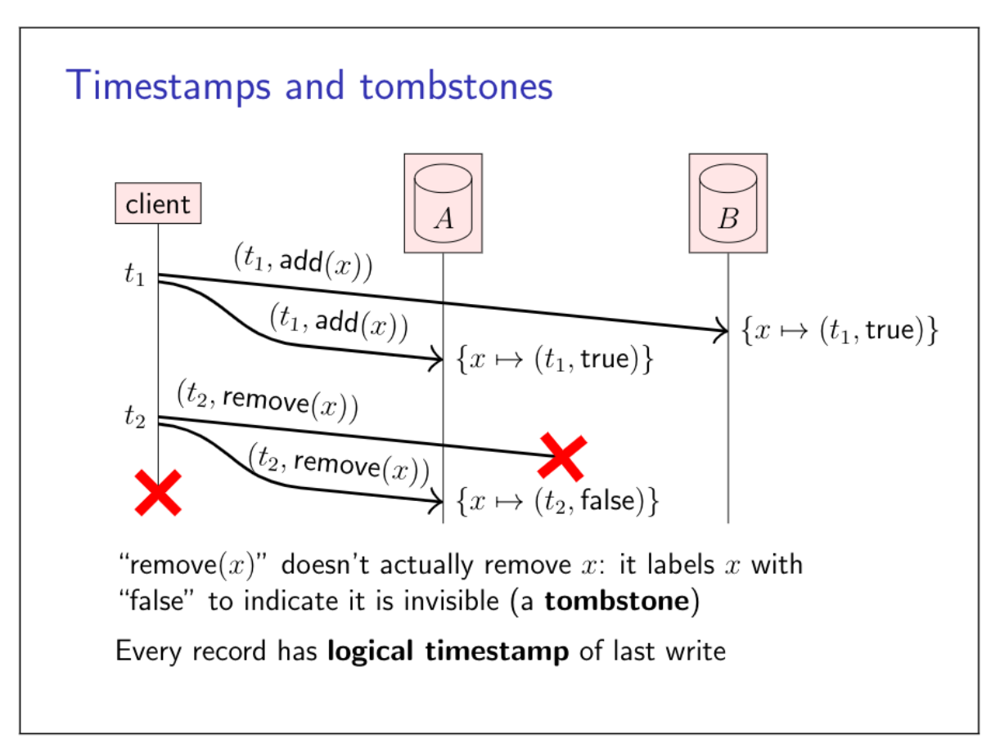
In many replicated systems, replicas run a protocol to detect and reconcile any differences (that is called anti-entropy), so that the replicas eventually hold consistent copies of the same data. Thanks to tombstones, the anti-entropy process can tell the difference between a record that has been deleted and a record that has not yet been created. And thanks to timestamps, we can tell which version of a record is older and which is newer. The anti-entropy process then keeps the newer and discards the older record.
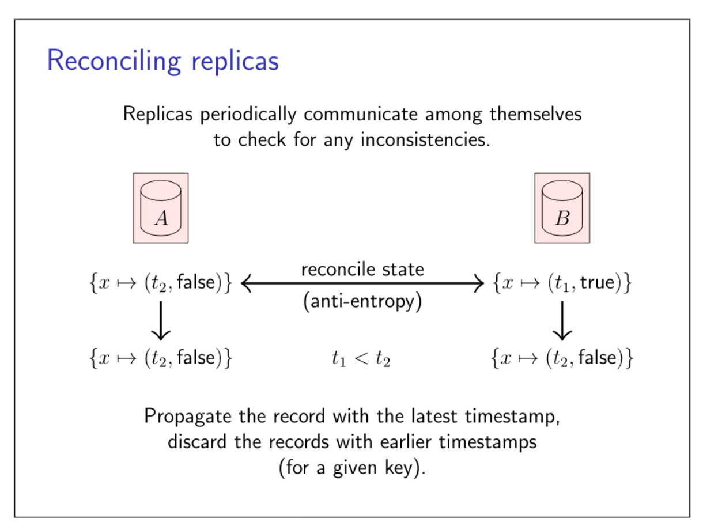 
### Concurrent wirtes by different clients
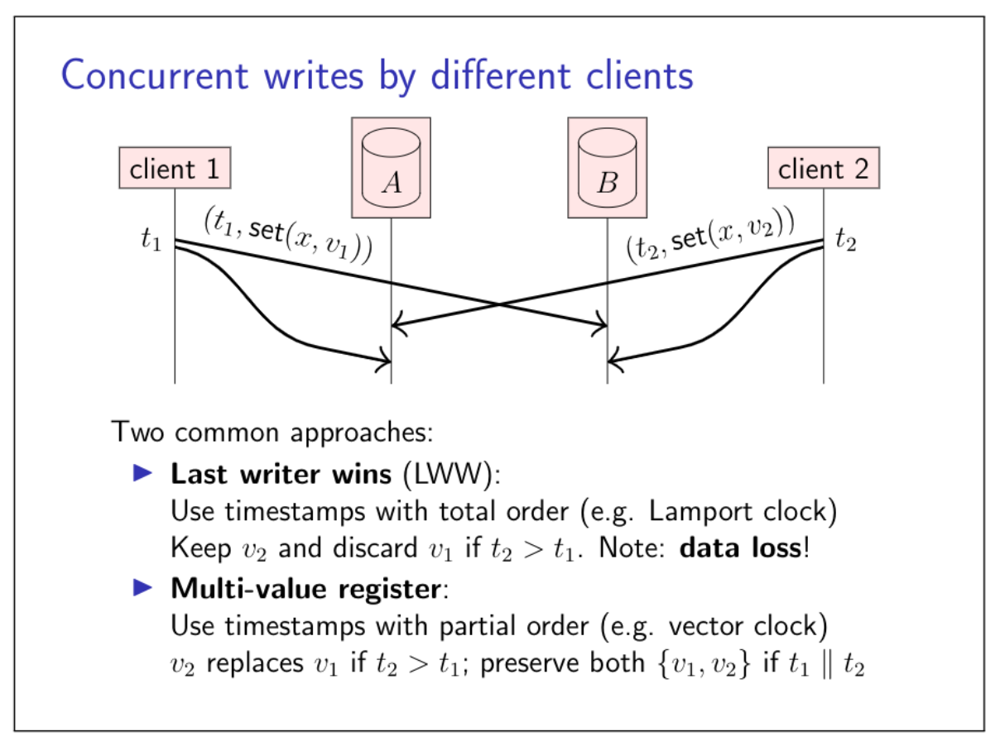
The details of this approach depend on the type of timestamps used.

- Lamport clocks capure a total order
- Vector clocks capure the partial order of happens-before
## 5.2 Quorum
A quorum is a minimum set of nodes that must respond to some request for it to be succeful.
### Probability of faults
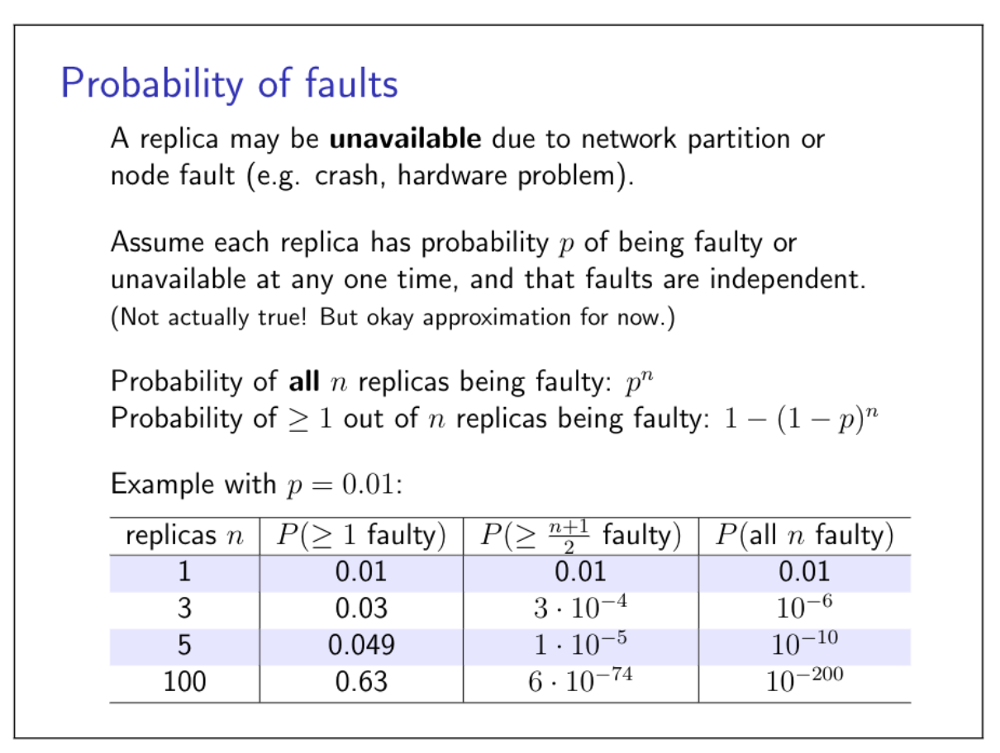
### Read-after-write consistency
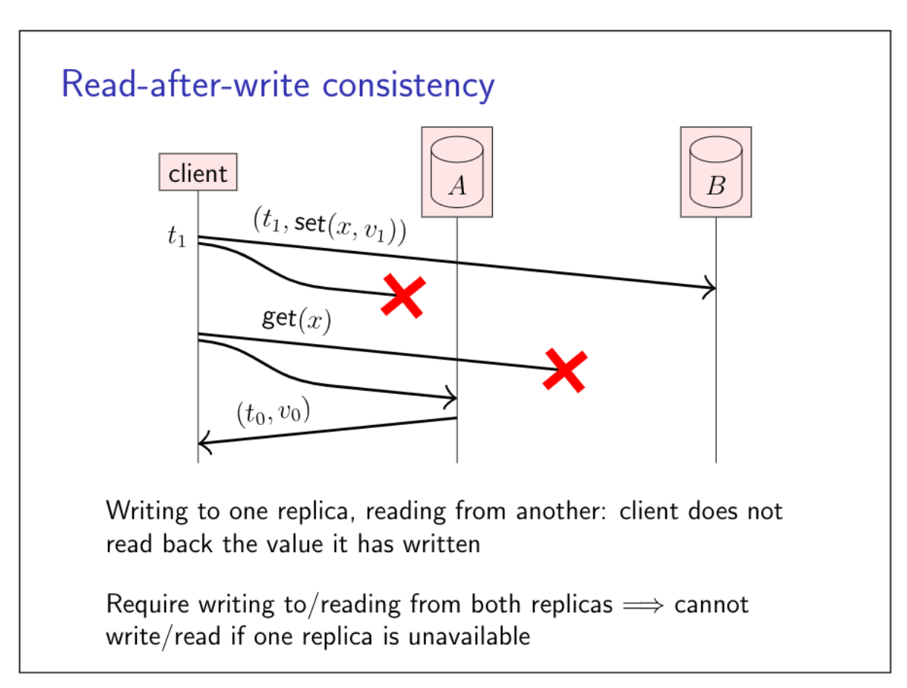
We can solve this conundrum by using three replicas.
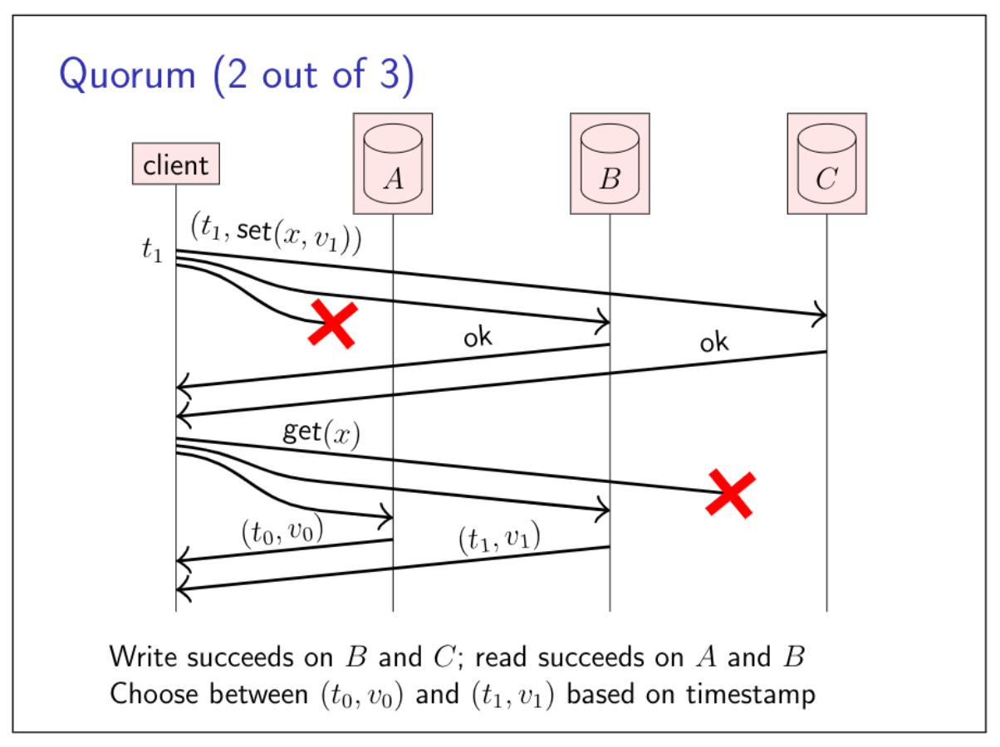
### Read and write quorums
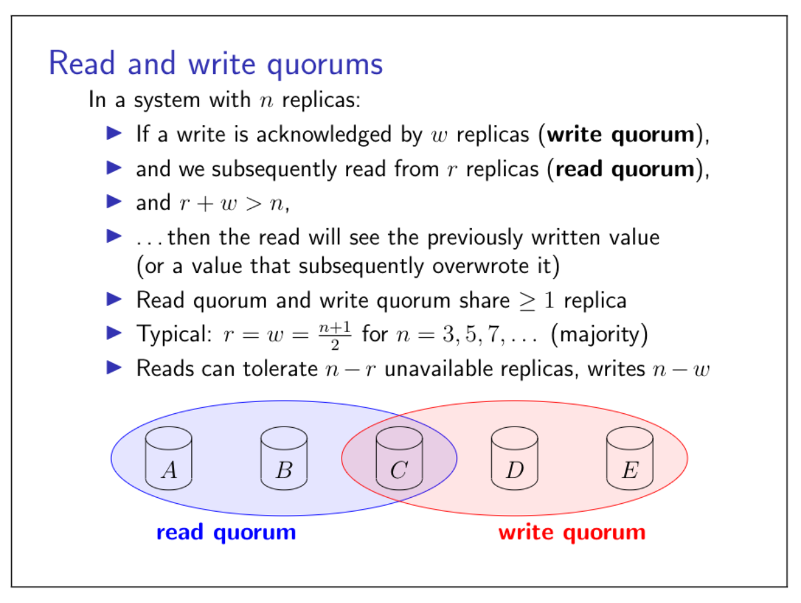
### Read repair
Another option is to ge clients to help with the process of disseminating updates.
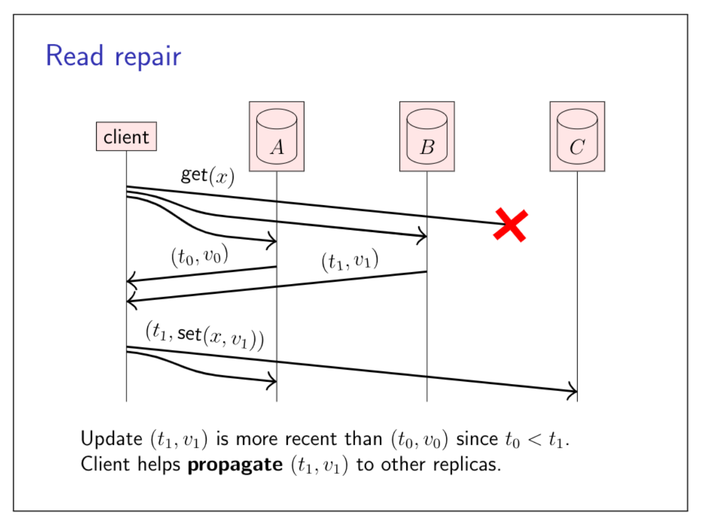
Databases that use this model fo replication are often called Dynamo-style, after Amazon's Dynamo database.
## 5.3 Replication using broadcast
Use FIFO-total order broadcast to implement replication.
### State machine replication
Total order broadcast: every node delivers the same messages in the same order.
**Stage machine replication** (SMR):

- FIFO-total order broadcast every update to all replicas
- Replica delivers update message: apply it to own state
- Applying an update is deterministic
- Replica is a state machine: starts in fixed initial state, goes through same sequence of state transitions in the same order => all replicas end up in the same state

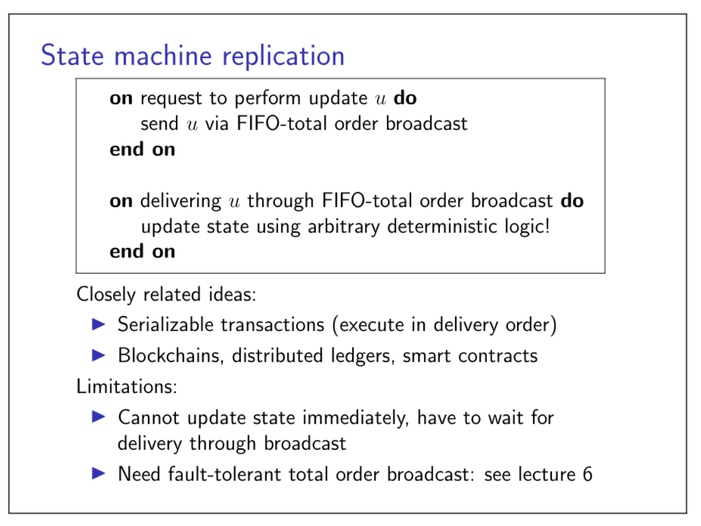
The downsides of state machine replication are the limitations of total order broadcast.
When a node wants to broadcast a message through a total order broadcast, it cannot immediately deliver that message to itself.
### Replication using causal (and weaker) broadcast
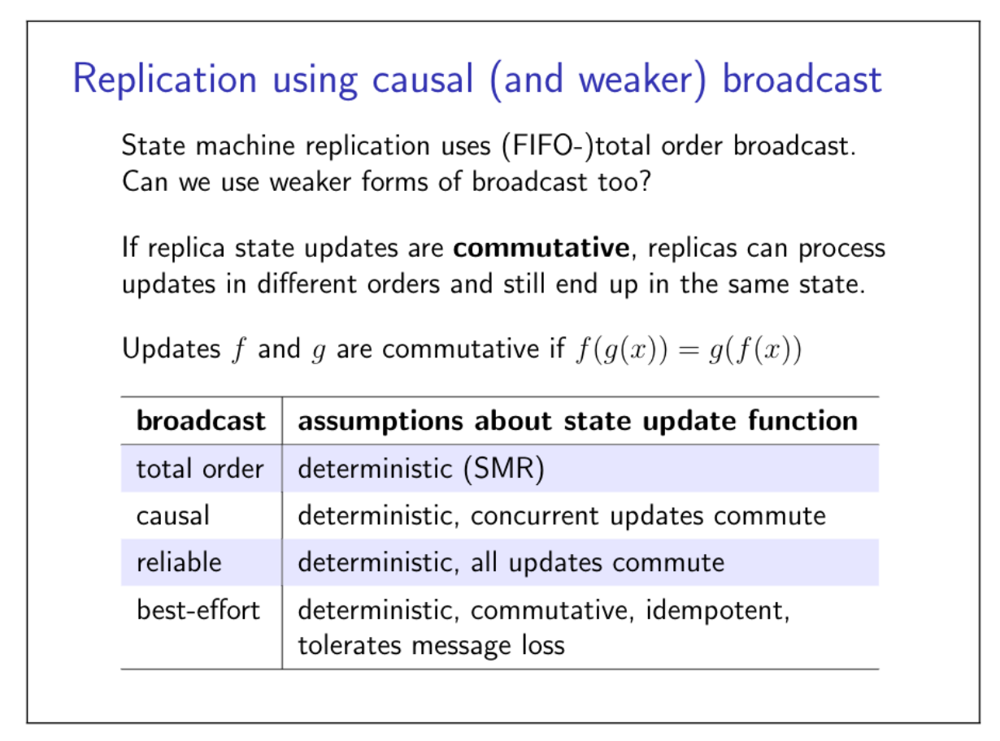
