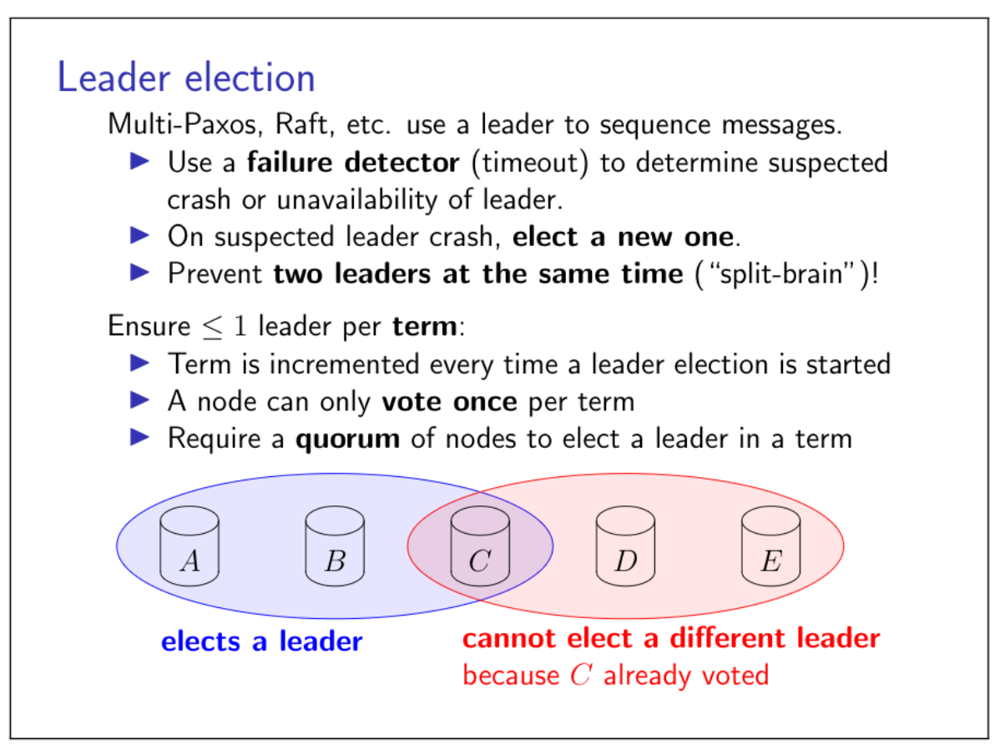
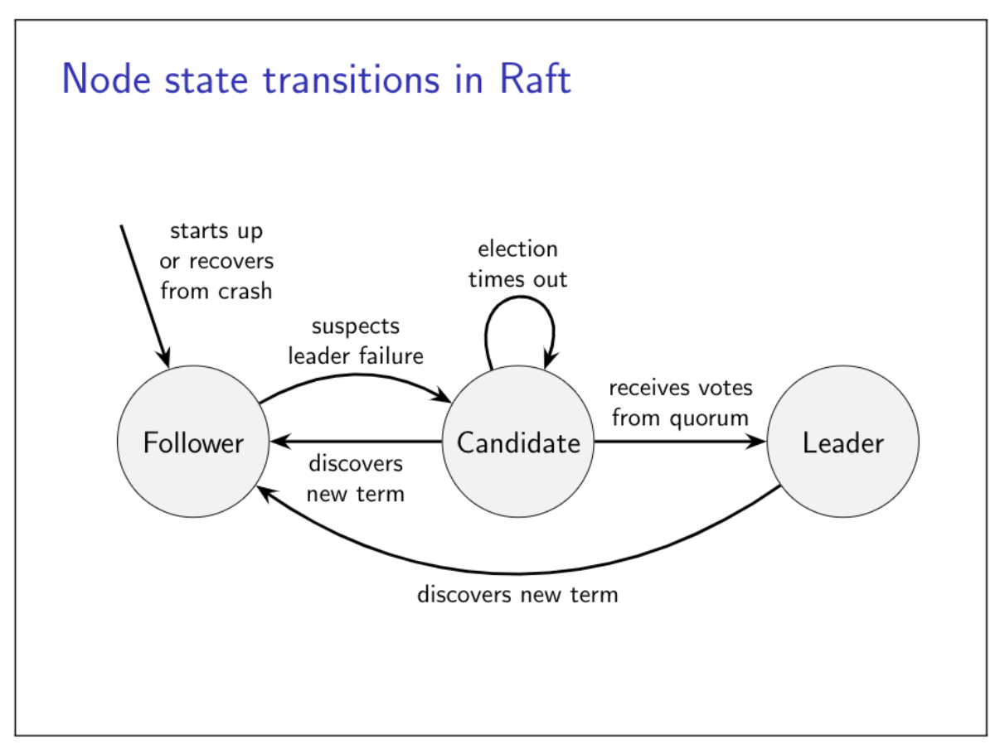
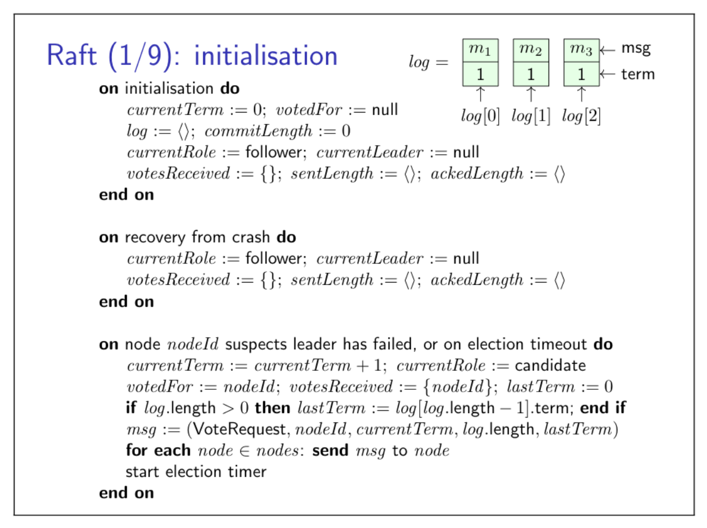
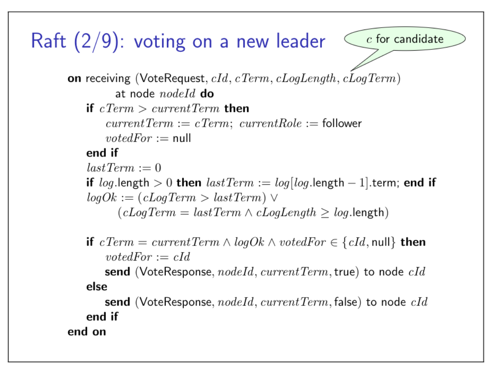
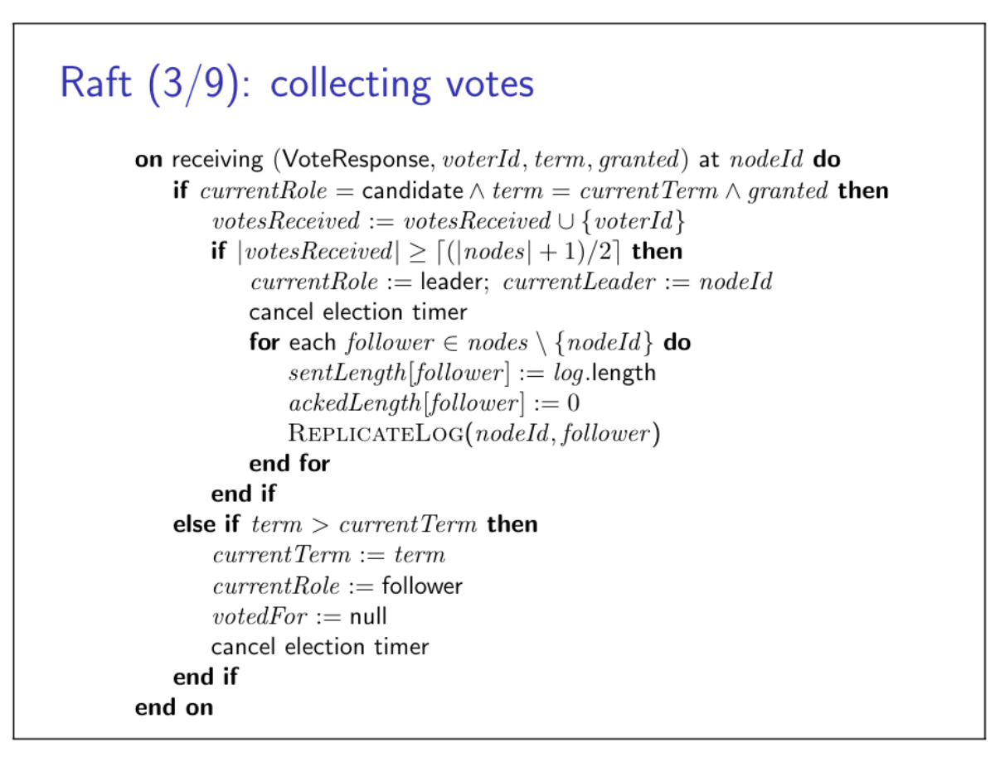
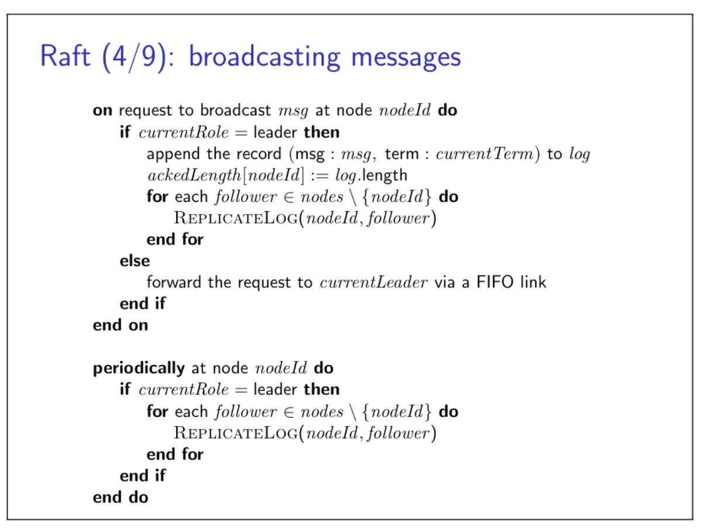
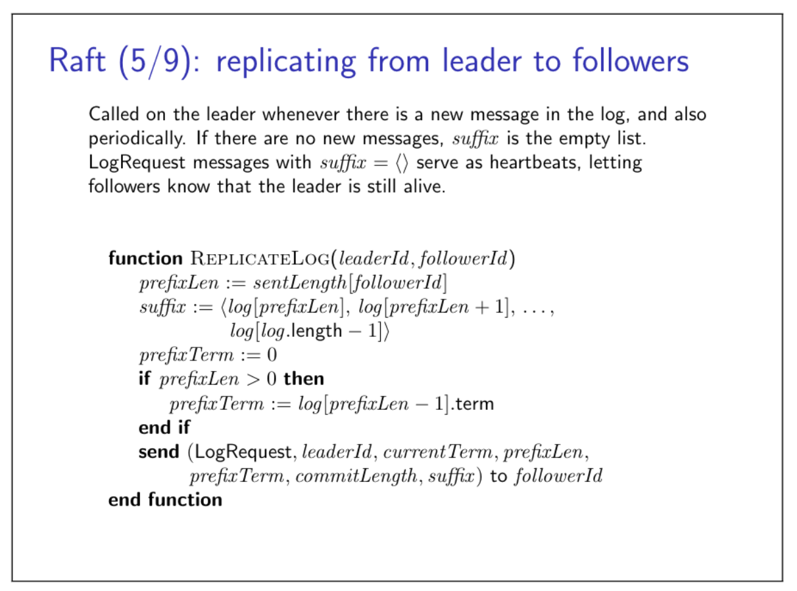
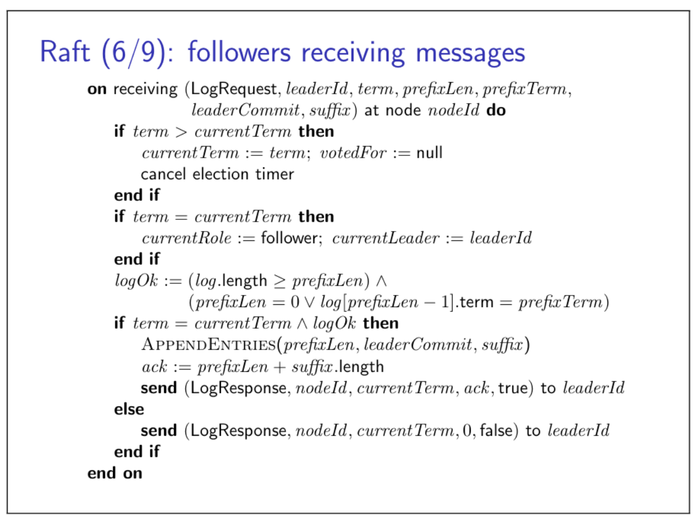
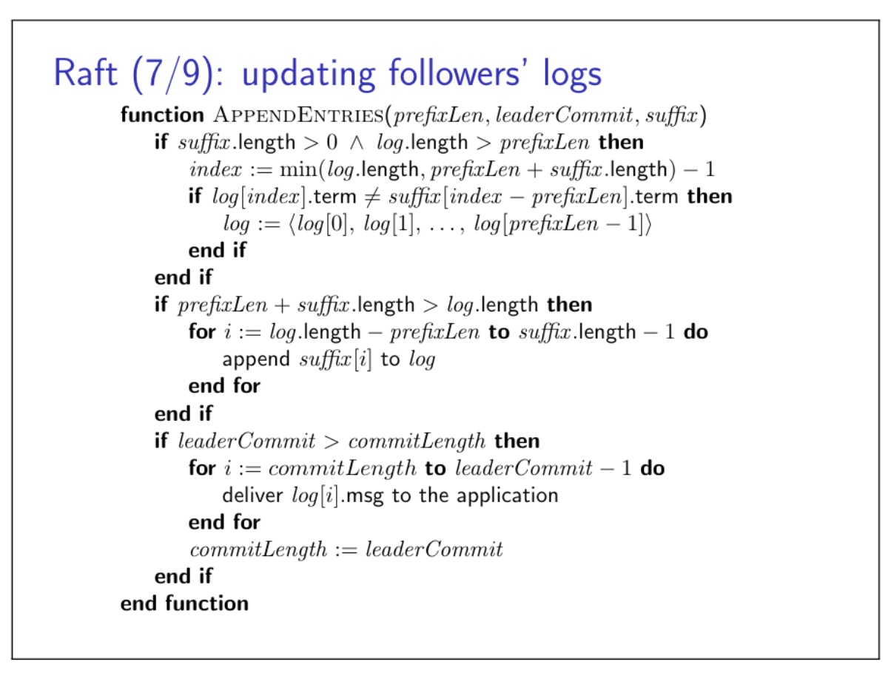
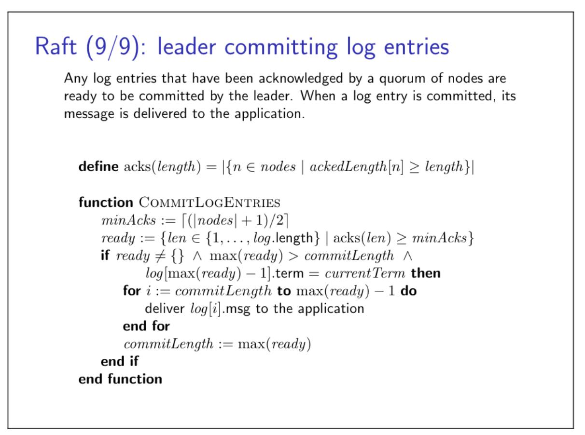

### Fault-tolerant total order broadcast
Total order broadcast is very usefull for enabling state machine replication. One way of implementing total order broadcast is by designating one node as the leader, and routing all messages via it. The leader then just needs to distributed the messages via FIFO broadcast, and this is sufficient to ensure that all nodes deliver the same sequence of messages in the same order.
But the leader is a single point of failure. What if leader crashes/becomes unavailable?

- Manual failover: a human operator chooses a new leader and reconfigures echo node to use new leader.

Used in many databases! Fine for planned manitenance. Unplanned outage? Humans are slow, may take a long time until system recovers...

- Automatically choose a new leader
## 6.1 Introduction to consensus
Consensus problem: several nodes want to come to agreement about a value. One or more nodes may propose a value, and then the consensus algorithm will decide on one of those values.
### Consensus and total order broadcast

- Traditional formulation of consensus: several nodes want to come to agreement about a single value
- In context of total order broadcast: this value is the next message to deliver
- Once one node decides on a certain message order, all nodes will decide the same order
- Consensus and total order broadcast are formally equivalent

Common consensus algorithms:

- Paxos: single-value consensus

Multi-Paxos: generalisation to total order broadcast

- Raft, Viewstamped Replication, Zab: FIFO-total order broadcast by default

It has been proved that no deterministic, asynchronous algorithm can solve the consensus problem with guaranteed termination. The fact is known as the FLP reulst, one of the most import theorems of distributed computing, named after its three authors Fischer, Lynch, and Paterson. Details in: Michael J. Fischer, Nancy A. Lynch, and Michael S. Paterson. Impossibility of distributed consensus with one faulty process. Journal of the ACM, 32(2):374–382, April 1985. doi:10.1145/3149.214121. URL https://groups.csail.mit.edu/tds/papers/ Lynch/jacm85.pdf.
### Leader election

## 6.2 The Raft consensus algorithm
Raft is a protocol for implementing distributed consensus.
For a graphical visualisation of the algorithm, see [http://thesecretlivesofdata.com/raft/](http://thesecretlivesofdata.com/raft/)
The Raft Paper see [https://raft.github.io/raft.pdf](https://raft.github.io/raft.pdf)
Raft Web site: 

- Leader election
- Log Replication: the same Append Entries message

Every node has:

- a state machine
- a log

There are two timetous:

- election timeout: is randomized
- heartbeat timeout: is fixed; Appened Entries message
### Node state transitions in Raft

### Raft 1: initialisation

### Raft 2: voting on a new leader

### Raft 3: collecting votes

### Raft 4: broadcasting messages

### Raft 5: replicating from leader to followers

### Raft 6: followers receiving messages

### Raft 7: updating follower's logs

### Raft 8: leader receiving log acknowledgements

### Raft 9: leader committing log entries

### Summary
Raft 1-3: leader election
Raft 4-9: process request
