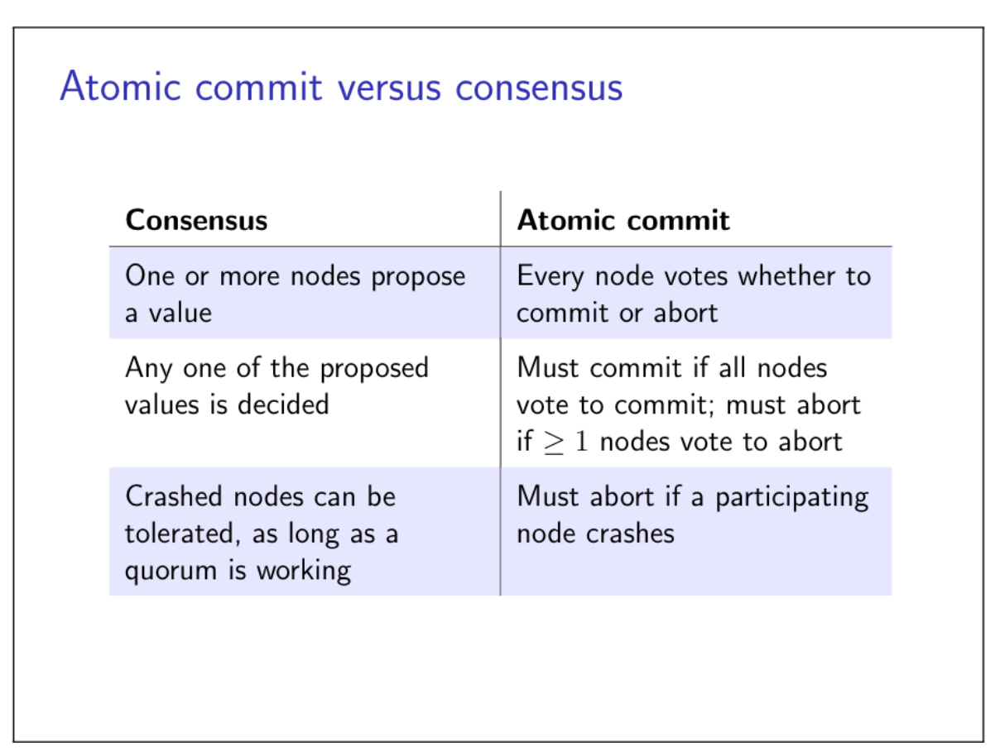
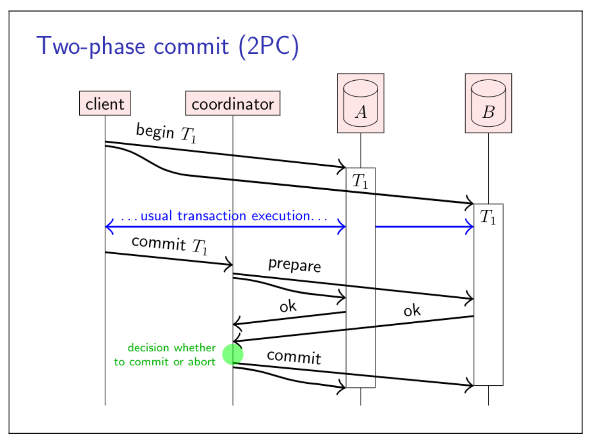
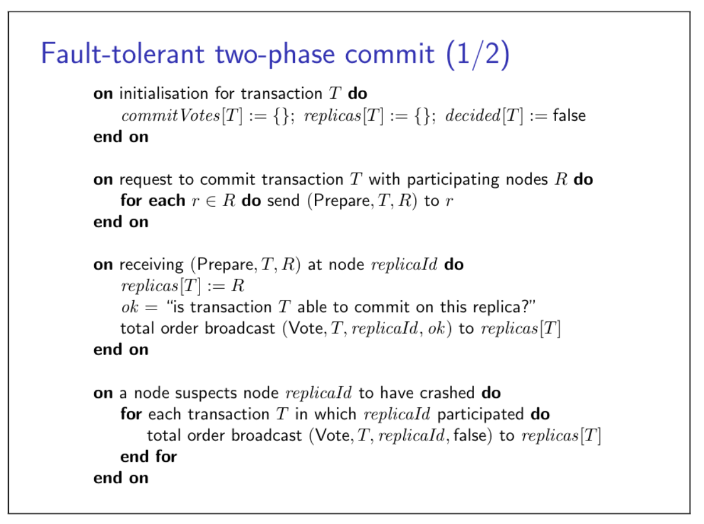
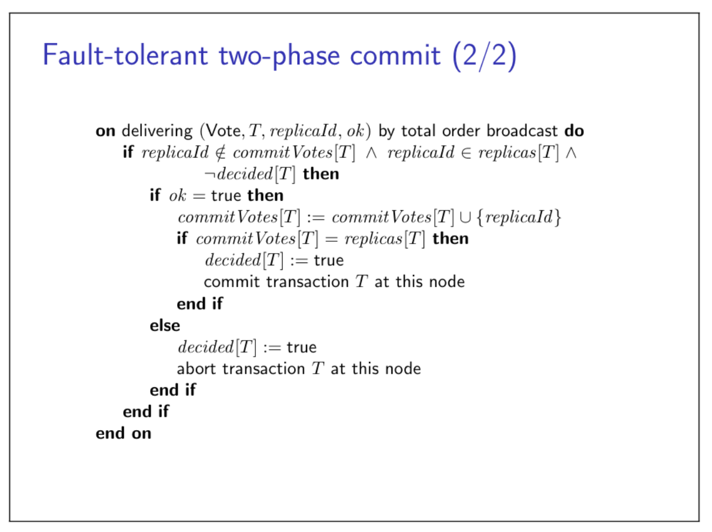
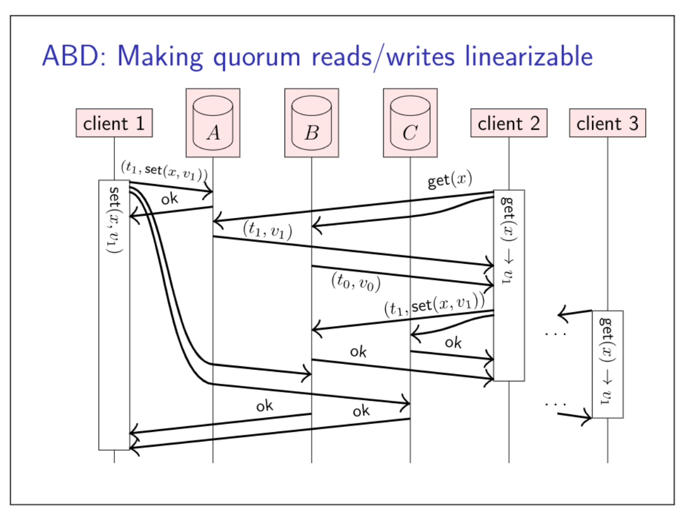
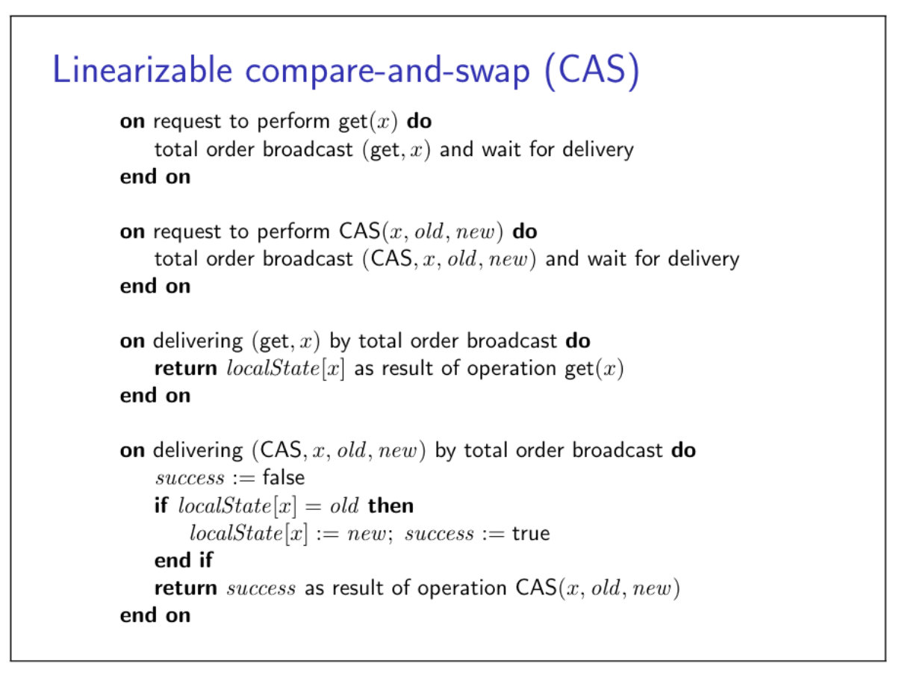
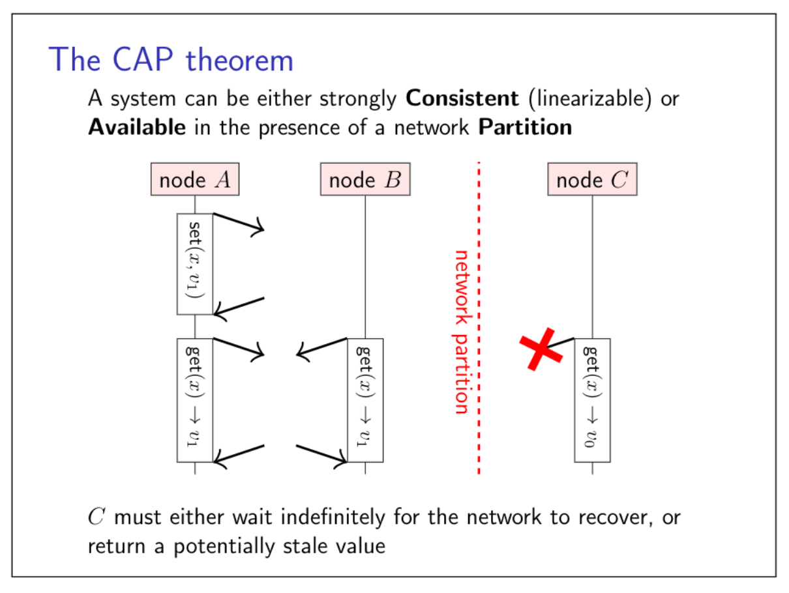
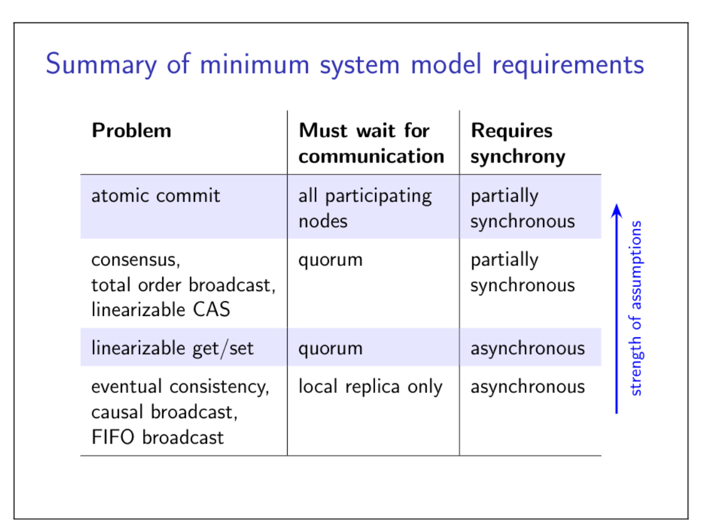

### Consistency
A word that means many different things in different contexts.

- ACID ([atomicity](https://en.wikipedia.org/wiki/Atomicity_(database_systems)), [consistency](https://en.wikipedia.org/wiki/Consistency_(database_systems)), [isolation](https://en.wikipedia.org/wiki/Isolation_(database_systems)), [durability](https://en.wikipedia.org/wiki/Durability_(database_systems))): a transaction transforms the database from one consistent state to another

Here, consistent = satisfying application-specific 

- Read-after-write consistency
- Replication: replica should be consistent with other replicas
- Consistency model
## 7.1 Two-phase commit
A distributed transaction: transaction that reads or writes data on multiple nodes. The data on these nodes may be replicas of the same dataset, or different parts of a larger dataset; a distributed transation applies in both cases.
### Distributed transactions
Recall atomicity in the context of ACID transactions:

- A transaction either commits or aborts
- If it commits, its updates are durable
- If it aborts, it has no visible side-effects
- ACID consistency (preserving invariants) relies on atomicity

If the transaction updates data on multiple nodes, this implies:

- Either all node must commit, or all must abort
- If any node crashes, all must abort
### Atomic commit versus consensus

### Two-phase commit (2PC)
The most common algorithm to ensure atomic commitment across multiple nodes is the two-phase commit (2PC) protocol. More see paper: Jim N. Gray. Notes on data base operating systems. In R. Bayer, R.M. Graham, and G. Seegmuller, editors, Op- erating Systems, volume 60 of LNCS, pages 393–481. Springer, 1978. doi:10.1007/3-540-08755-9 9. URL http: //jimgray.azurewebsites.net/papers/dbos.pdf.
The communication flow of 2PC is illustrated as follow:

And this is a coordinator-based 2PC. But there is a problem: a single point of failure.
### The coordinator in two-phase commit
What if the coordinator crashes?

- Coordinator writes its decision to disk
- When it recovers, read decision from disk and send it to replicas (or abort if no decision was made before crash)
- **Problem**: if coordinator crashes after preprare, but before broadcasting decision, other nodes do not know how it has decided
- Replicas participating in transaciton cannot commit or abort after responding "ok" to the prepare request (otherwise we risk violating atomicity)
- Algorithm is blocked until coordinator recovers

In order to avoid a single point of coordinator failure, proposed **a 2PC based on Paxos Commit**, see paper Jim Gray and Leslie Lamport. Consensus on transaction commit. ACM Transactions on Database Systems, 31(1):133–160, March 2006. doi:10.1145/1132863.1132867. URL http://db.cs.berkeley.edu/cs286/papers/paxoscommit-tods2006.pdf.
### Fault-tolerant two-phase commit

## 7.2 Linearizability
An atomic commitment protocol is a way of preserving consistency across multiple replicas in the face of faults, by ensuring that all participants of a transaction either commit or abort. However, when there are multiple nodes concurrently reading and modifying some shared data concurrently, ensuring the same commit or abort outcome for all nodes is not sufficient.
Multiple nodes concurrently accessing replicated data.
How do we define "consistency" here?
The strongest option: **linerarizability**

- Informally: every operation takes effect atomically sometime after it started and before it finished
- All operations behave as if executed on a single copy of the data (even if there are in fact multiple replicas)
- Consequence: every operation returns an "up-to-date" value, a.k.a. "strong consistency"
- Not just in distributed systems, also in shared-memory concurrency (memory on multi-core CPUs is not linearizable by default)

NOTE: linearizability != serializability

- Serializability: transactions have the same effect as if they had been executed in some serial order, but it does not define what that order should be
- Linearizability: defines the values that operations must return, depending on the concurrency and relavie order of those operations.

The purpose of linearizability is to make a system behave as if there was only a single copy of the data, and all operations on it happen atomically, even if the system is in fact replicated.
### ABD algorithm
ABD algorithm named after its authors Attiya, Bar-Noy,  and Dolev. More see: Hagit Attiya, Amotz Bar-Noy, and Danny Dolev. Sharing memory robustly in message-passing systems. Journal of the ACM, 42(1):124–142, January 1995. doi:10.1145/200836.200869. URL http://www.cse.huji.ac.il/course/2004/dist/p124- attiya.pdf.

### Linearizability for different types of operation
This ensures linearizability of get (quorum read) and set (blind write to quorum)

- When an operation finishes, the value read/written is stored on a quorum of replicas
- Every subsequent quorum operation will see that value
- Multiple concurrent writes may overwirte each othe

The set operation for which the ABD algorithm ensures linearizability is a so-called blind write (unconditional write): it simply overwrites the value of a data item, regardless of its previous value. If multiple clients concurrently write to the same item,  it uses a last-wirter-wins conflict resolution policy, i.e. one of those writes will end up as the winner and the other vlaues will silently be discard.
But in some applications, we want to be more carefull and overwirte a value only if it has not been concurrently modified by another node. This can be achieved with an atomic compare-and-swap (CAS) operation.
### CAS algorithm
It is possible to implement a linearizable, replicated CAS operation using total order broadcast.

## 7.3 Eventual consistency
Linearizability is a very convenient consistency model for distributed systems, because it guarantees that a system behaves as if there was only one copy of the data, even if it is in fact replicated.
But this strong guarantee also comes at cost and therefore linearizability is not suitable for all applications.
Linearizability advantanges:

- Make a distributed system behave as if it were non-distributed
- Simple for applications to use

Downsides:

- **Performance** cost: lots of messages and waiting for responses
- **Scalability** limits: leader can be a bottleneck
- **Availability** problems: if you can't contact a quorum of nodes, you can't process any operations

**Eventual consistency**: a weaker model than linearizability. Different trade-off choices.
### The CAP (consistency, availability, partition tolerance) theorem
The trade-off is known as the CAP theorem, which states that if there is a network partition in a system, we must choose between one of the following options:

1. We can have linearizable consistency, but in this case, some relicas will not be able to respond to requests because they cannot communicate with a quorum. Not being able to respond to requests makes those nodes effectively unavailable.
2. We can allow replicas to respond to requests even if they cannot communicate with other replicas. In this case, they continue to be available, but we cannot guarantee linearizability.

### Eventual consistency
#### Eventual consistency
Replicas process operations based only on their local state.
If there are no more updates, eventually all replicas will be in the same state. (No guarantees how long it might take.)
#### Strong eventual consistency

- Eventual delivery: every update made to one non-faulty replica is eventually processed by every non-faulty replica。
- Convergence: any two replicas that have processed the same set of udpates are in the same state (even if updates were processed in a different order).

Properties:

- Does not require waiting for network communication
- Causal broadcast (or weaker) can disseminate updates
- Concurrent updates => conflicts need to be resolved

In both eventual consistency and strong eventual consistency, there is the possibility of different nodes concurrently updating the same object, leading to conflicts.
### Summary

