## 8.1 Collaboration and conflict resolution
Nowadays we use a lot of collaboration software:

- Examples: calendar sync, Google Docs, ...
- Several users/devices working on a shared file/document 
- Each user device has local replica of the data
- Update local replica anytime (even while offline), sync with others when network available 
- Challenge: how to reconcile concurrent updates？

Families of algorithms:

- Conflict-free Replicated Data Types (**CRDTs**)
   - Operation-based
   - State-based
- Operation Transformation (**OT**)
### Operation-based CRDTs
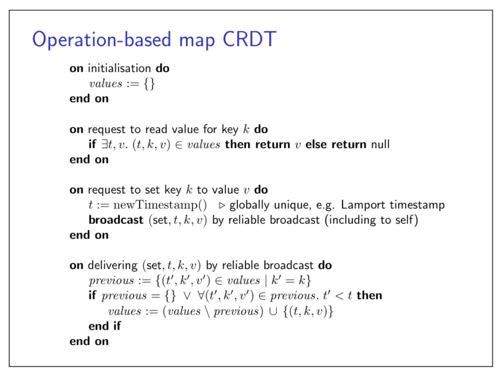
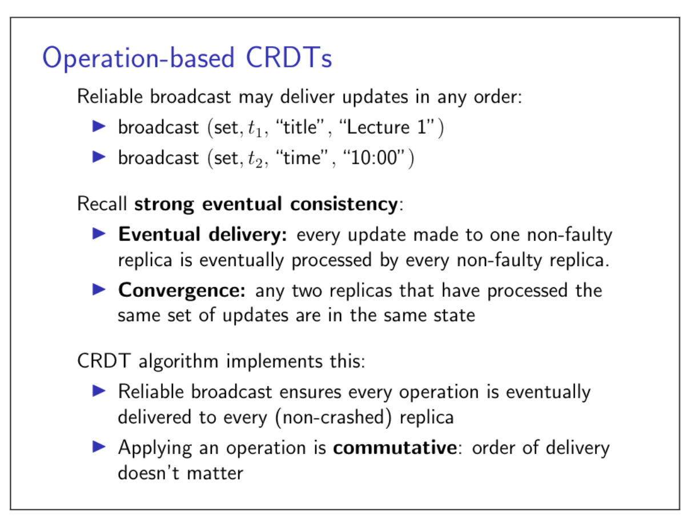
### State-based CRDTs
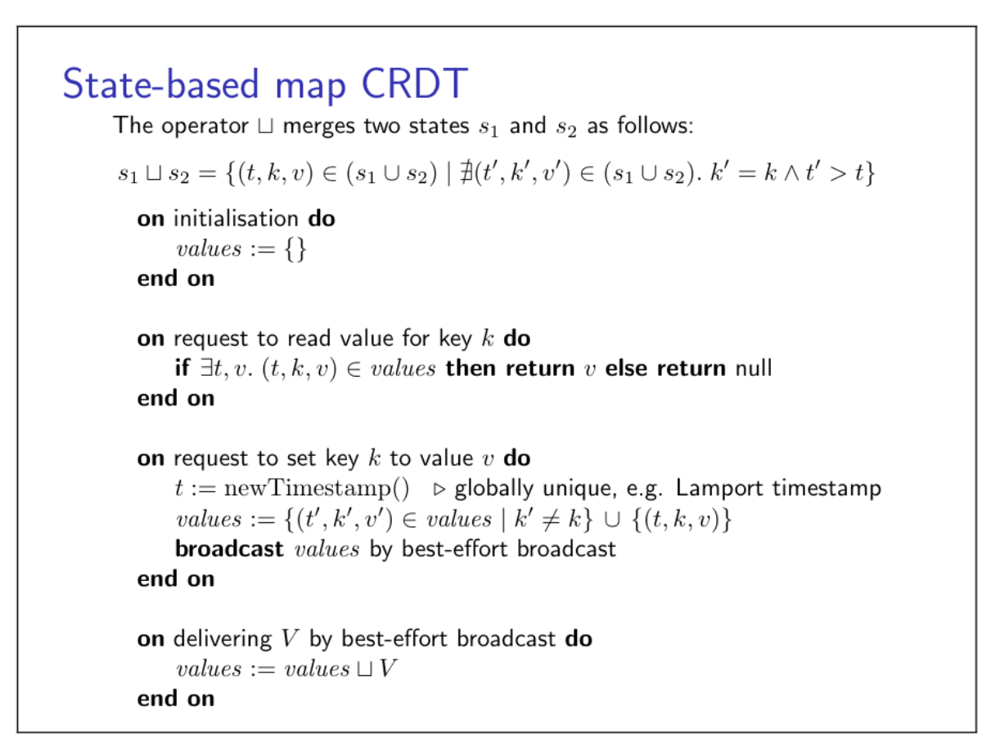
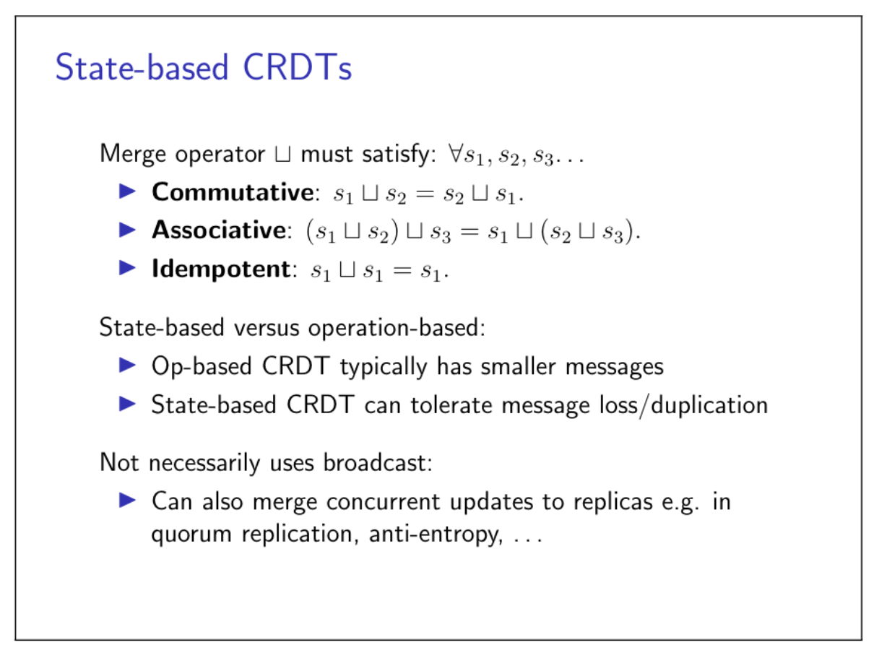
### Operational transformation
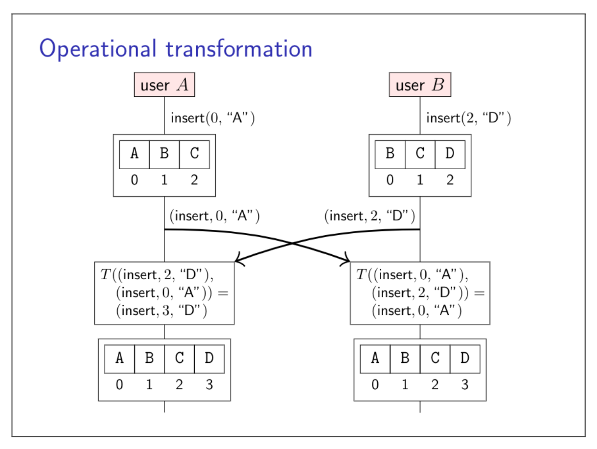
## Text editing CRDT
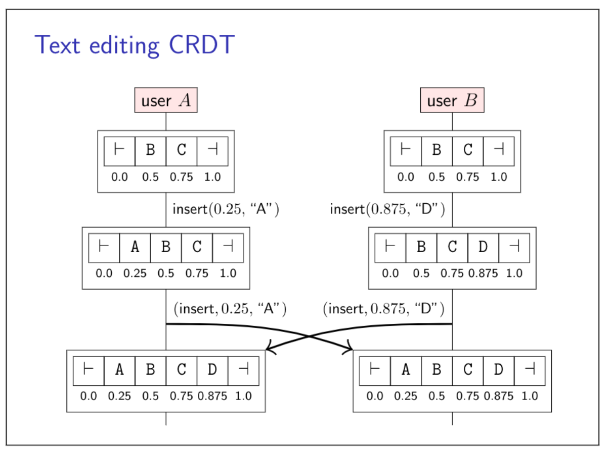
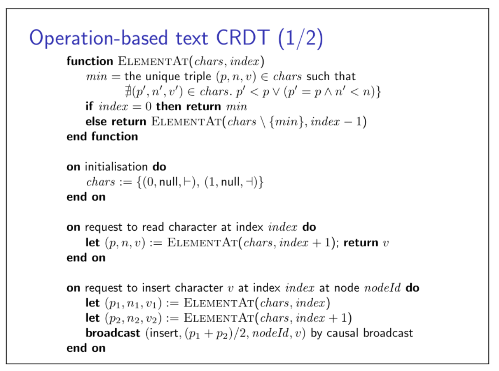
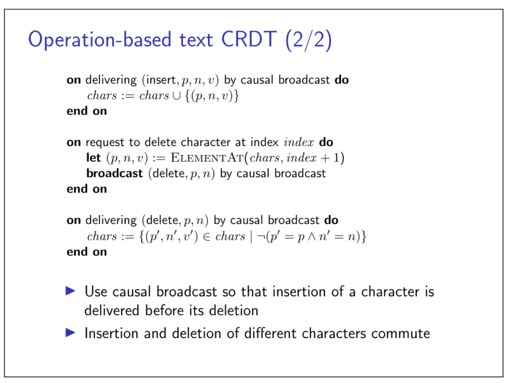
**Note**: The most wonderfull thing is the method `ELEMENTAT`.
## 8.2 Google' Spanner
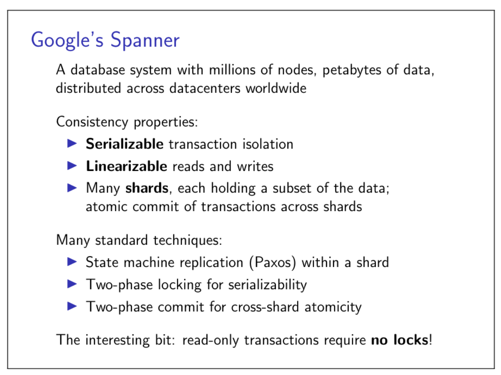
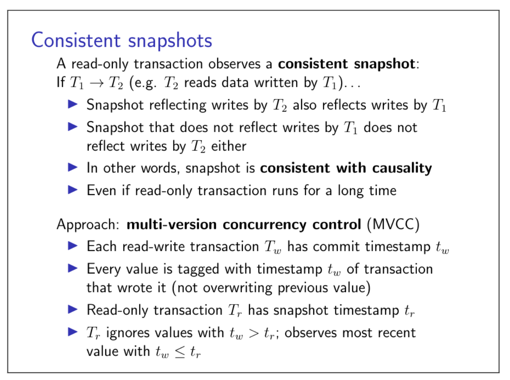
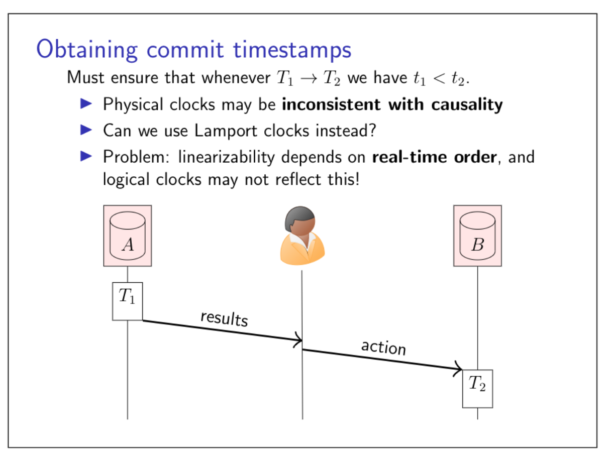
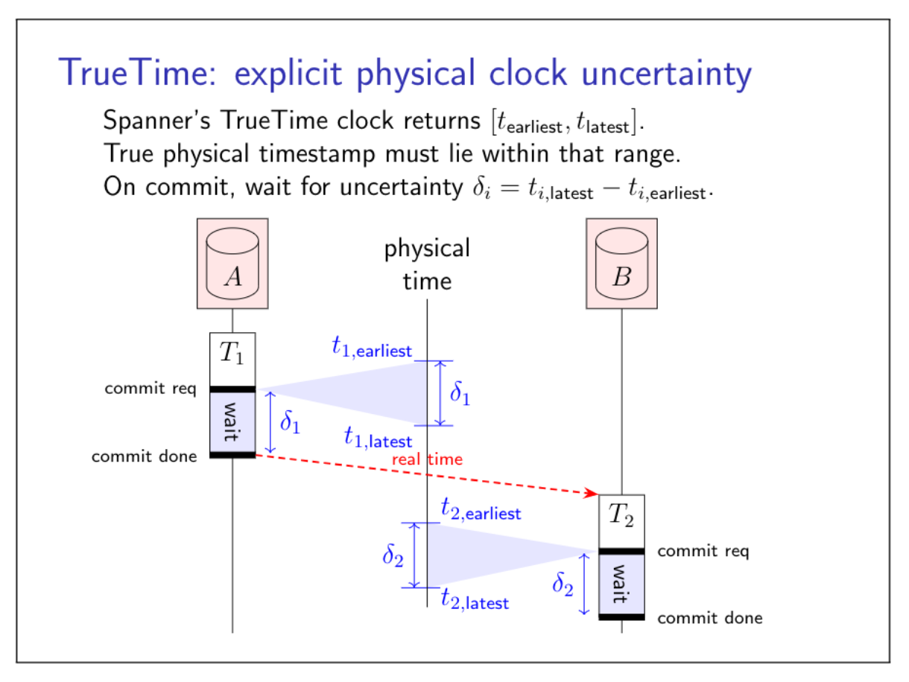
## Summary

- Distributed systems are everywhere
- We use them every day
- Key goals: availability, scalability, performance
- Key problems: concurrency, faults, unbounded latency
- Key abstractions: replication, broadcast, consensus
- No one right way, just trade-offs
