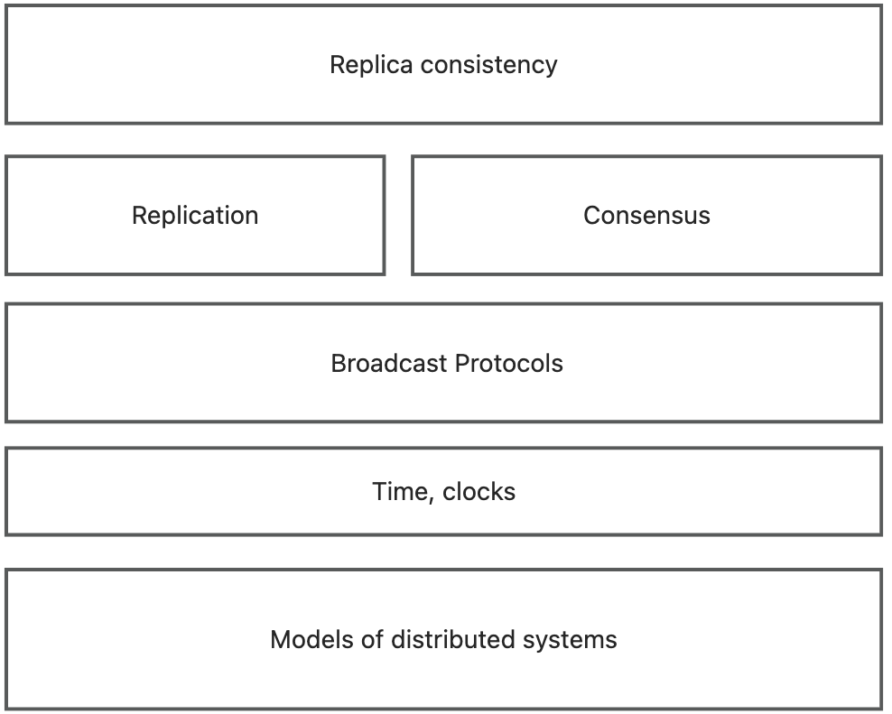

## Why make a system distributed?

- It's inherently distributed
- For better reliability
- For better performance
- To solve bigger problemms
## What problems need to be solved?

- Faults
   - Communication may fail: network fail
   - Processes may crash: nodes crash, run much slower than usual, or misbehave in some other way
   - All of this may happen nondeterministically 
- Concurrency
- Unbounded latency
## How to solve these problems?
### Key goals

- availability

Fault tolerance: detect failures, tolerate some parts of system being broken; we want the system as a whole to continue working, even when some parts are faulty.

- scalability
- performance
### Abstraction: System models
Two classic **thought experiments** in distributed systems:

- Two generals problem: **a model of networks**
   - the only way of knowing somthing is to communicate it
- Byzantine generals problem: **a model of node behaviour**
   - can be solved only if strictly fewer than one third of the generals are malicious

Capture assumptions in a system model consisting of:

- Network behaviour (e.g. message loss)
   - Reliable (perfect) links
   - Fair-loss links
   - Arbitrary links (active adversary)
- Node behaviour (e.g. crashes)
   - Crash-stop (fail-stop)
   - Crash-recovery (fail-recovery)
   - Byzantine (fail-arbitrary)
- Timing behaviour/Synchrony assumptions (e.g. latency)
   - Synchronous
   - Partially synchronous
   - Asynchronous
### Time, clocks and ordering of events
Most operating systems and programming languages provide both:

- Time-of-day clock
- monotonic clock
### Broadcast protocols and logical time
#### Logical clocks

- Lamport clocks: total order 
- Vector clocks: partial order of happens-before
#### Broadcast protocols

- FIFO broadcast
- Causal broadcast
- Total order broadcast
- FIFO-total order broadcast
### Replication
Replication means to maintain a copy of the same data on multiple nodes, each of which is called a replica. It is one of the main mechanisms we have for achieving fault tolerance.

- Quorums
- Replicaiton using broadcast
### Consensus

- Raft consensus algorithm
### Replica consistency

- Two-phase commit
- Linearizability
- Eventual consistency
### Framework

